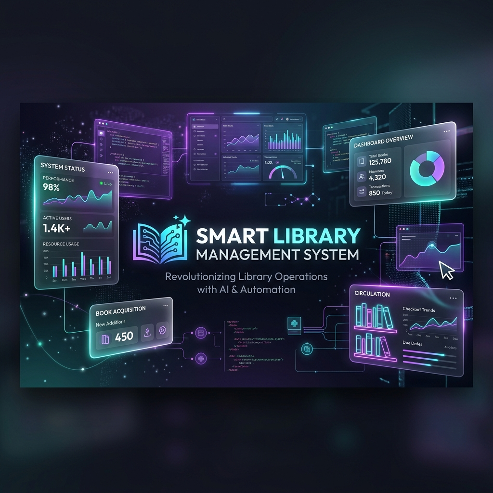
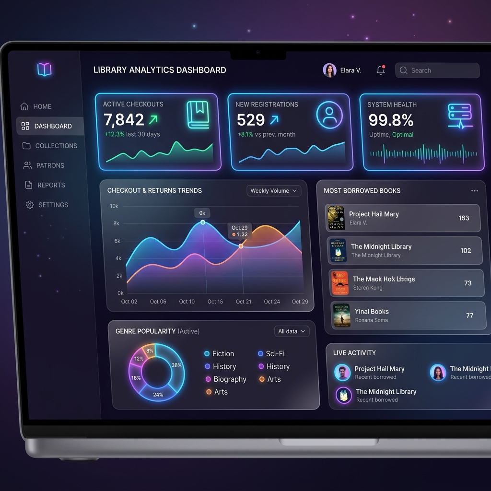
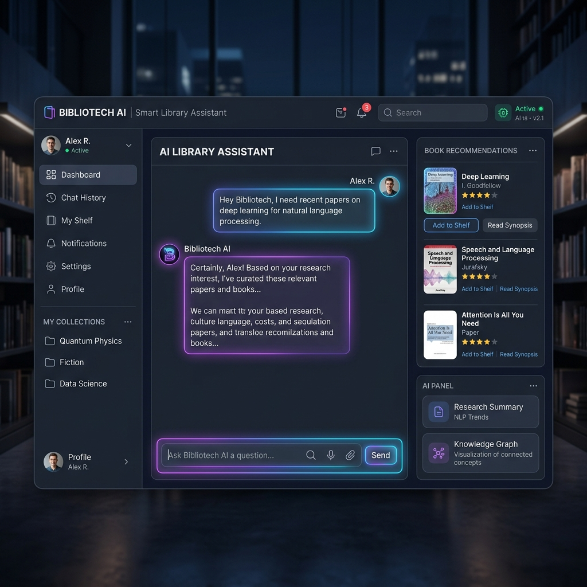
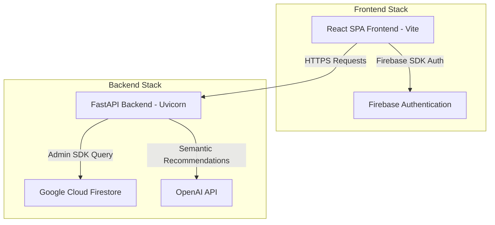

# 📚 Smart Library Management System (SaaS Edition)

[](https://fastapi.tiangolo.com)
[](https://reactjs.org)
[](https://vitejs.dev)
[](https://firebase.google.com)
[](https://tailwindcss.com)
[](https://openai.com)

A production-ready, feature-rich SaaS-style Smart Library Management System. This project combines a high-performance **FastAPI** backend, **Firebase Firestore** database, **Firebase Authentication**, **OpenAI-powered** semantic assistants, and a breathtaking **React + Tailwind CSS + Framer Motion** frontend.

---

## 🎨 Preview & Aesthetics

### Project Banner


<table width="100%">
  <tr>
    <td width="50%">
      <p align="center"><b>📊 Library Analytics & Dashboard</b></p>
      
    </td>
    <td width="50%">
      <p align="center"><b>🤖 Socrates & Ruixen AI Chat Assistant</b></p>
      
    </td>
  </tr>
</table>

---

## 🔥 Key Features

### 👤 Librarian Workspace (Admin Panel)
- **Interactive Dashboard:** Live counts of active checkouts, overdue books, new student registrations, and overall system health.
- **Manage Books:** Complete CRUD operations with search, filtering, and a **Bulk Import Panel** for uploading catalog sheets.
- **Borrow Records:** Detailed audit log of checkouts, returns, and overdue calculations.
- **Database Monitor:** Real-time diagnostics view displaying API response times, Firestore rule health, and cache status.
- **AI Assistant:** An intelligent co-pilot for librarians to analyze library statistics, query popular books, or ask catalog questions.

### 🎓 Student Portal
- **Browse & Search Catalog:** Find books by title, author, genre, or ISBN with cover images fetched on the fly.
- **Wishlist & Cart:** Save books for future reading and request borrowings.
- **Digital Library Card & Scanner:** Generate QR codes for quick scan checkouts at the physical library counter.
- **Borrowed Books & History:** View active checkouts, return due dates, and historic reading logs.
- **AI Study Guide:** Speak directly to the AI library bot to request personalized book recommendations based on reading history.

---

## 🏗️ System Architecture



---

## 🛠️ Technology Stack

- **Frontend:** React 19, Vite, Tailwind CSS, Framer Motion, Lucide Icons
- **Backend:** FastAPI, Python 3.10+, Uvicorn, Pydantic v2
- **Database:** Firebase Firestore (NoSQL, real-time)
- **Auth:** Firebase Auth (Email/Password & Google Sign-In)
- **AI Core:** OpenAI GPT API

---

## 🚀 Step 1: Backend Setup (FastAPI)

### 1. Configure the Environment
Copy `backend/.env.example` to `backend/.env` and fill in the required environment variables:
```env
FIREBASE_CREDENTIALS=path/to/firebase-adminsdk.json
OPENAI_API_KEY=sk-your-openai-key
```
*(If you do not set Firebase credentials locally, the backend will still run but Firestore-backed routes will fall back to mocked responses).*

### 2. Install Dependencies & Run
```bash
cd backend
python -m venv venv

# On Windows:
venv\Scripts\activate
# On Mac/Linux:
source venv/bin/activate

pip install -r requirements.txt
uvicorn main:app --reload
```
The FastAPI instance will boot at `http://localhost:8000`. 
Check `http://localhost:8000/docs` to see your completely auto-generated Swagger API documentation.

---

## 💻 Step 2: Frontend Setup (React + Vite)

### 1. Configure Firebase Credentials
Copy `frontend/.env.example` to `frontend/.env` and fill in the Firebase Config values:
1. Go to the [Firebase Console](https://console.firebase.google.com).
2. Create a new project and add a **Web App**.
3. Enable **Email/Password** and **Google** under the **Authentication** tab.
4. Copy the config parameters into `frontend/.env` (keys starting with `VITE_FIREBASE_*`).
5. Set `VITE_API_BASE_URL` to your backend URL (e.g., `http://localhost:8000`).

### 2. Start the Development Server
```bash
cd frontend
npm install
npm run dev
```

Your breathtaking Glassmorphism Dashboard UI will be available at `http://localhost:5173/`.
Because it uses Firebase Authentication out of the box, it will immediately redirect you to the Login Screen until you register.

---

## 🌐 Step 3: Deployment (Render + Vercel)

This repository includes pre-configured `render.yaml` and `frontend/vercel.json` configurations for seamless deployment.

### A. Deploy Backend to Render
1. Push this repository to GitHub.
2. In Render, create a new **Blueprint** (recommended) or a **Web Service**.
3. If using Web Service, set the **Root Directory** to `backend`.
4. Render will use the start command: `uvicorn main:app --host 0.0.0.0 --port $PORT`.
5. Add the environment variables:
   - `FIREBASE_CREDENTIALS` (paste the full service account JSON contents)
   - `OPENAI_API_KEY`
   - Optional: `OPENAI_BASE_URL`, `OPENAI_MODEL`
   - `PUBLIC_API=true` (enables public preview mode)

### B. Deploy Frontend to Vercel
1. In Vercel, import your GitHub repository.
2. Set the **Root Directory** to `frontend`.
3. Add `VITE_API_BASE_URL` pointing to your Render backend URL (e.g., `https://your-service.onrender.com`).
4. Click **Deploy**. SPA rewrites are automatically handled by `frontend/vercel.json`.

---

## 🧪 Borrow System Verification

Use the built-in flow checker script to validate the transactional flow before releasing:

```bash
python backend/scripts/verify_borrow_flow.py --base-url http://localhost:8000
```

**What it validates:**
- Borrow record creation.
- Dynamic decrement of `available_copies` on borrow.
- Returns and idempotent state verification.
- Dynamic increment of `available_copies` on return.
- Record lookup in the general history log.

---

## 📜 License
This project is open-source under the MIT License. Developed with ❤️ by [shreyashmane-dev](https://github.com/shreyashmane-dev).
